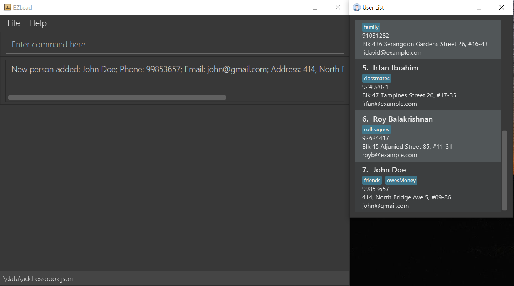
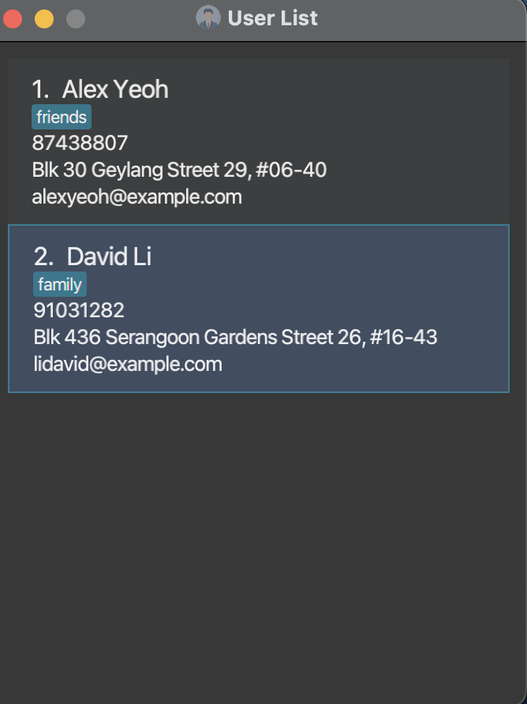
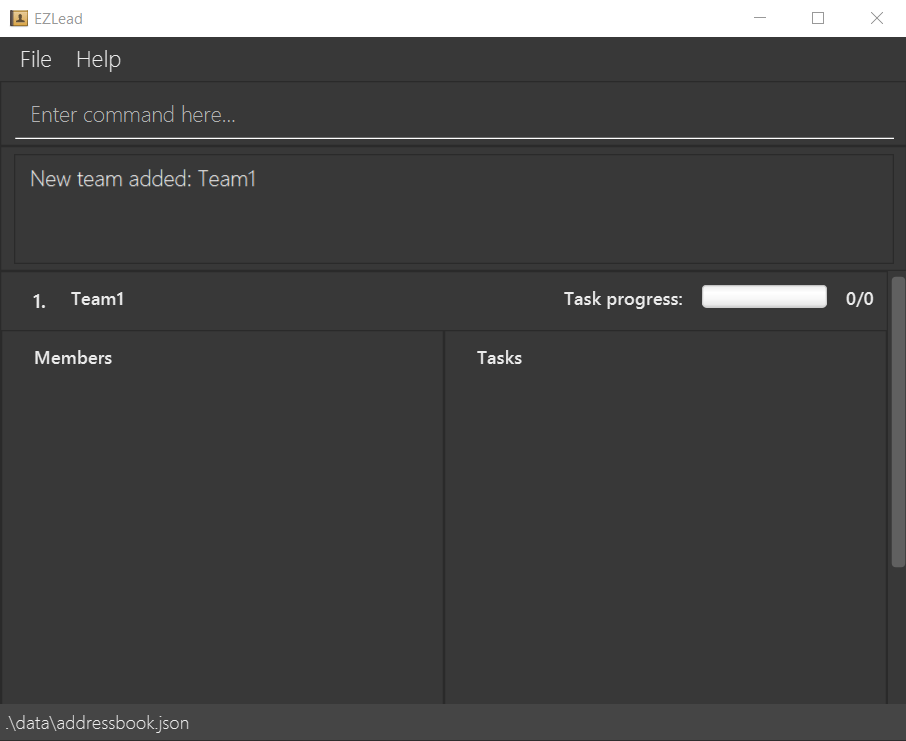
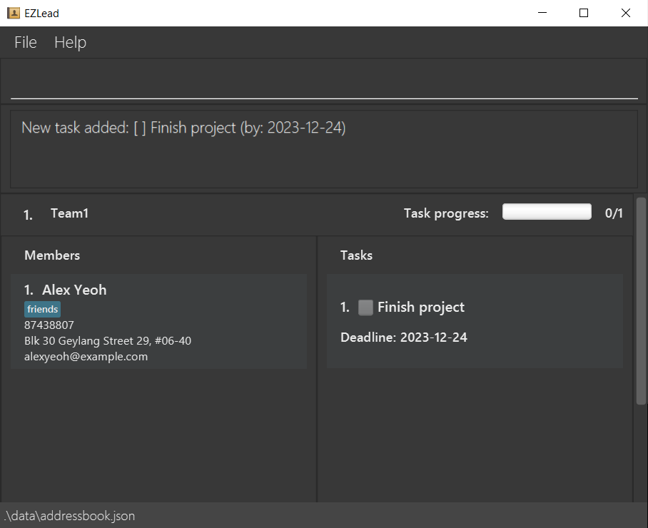
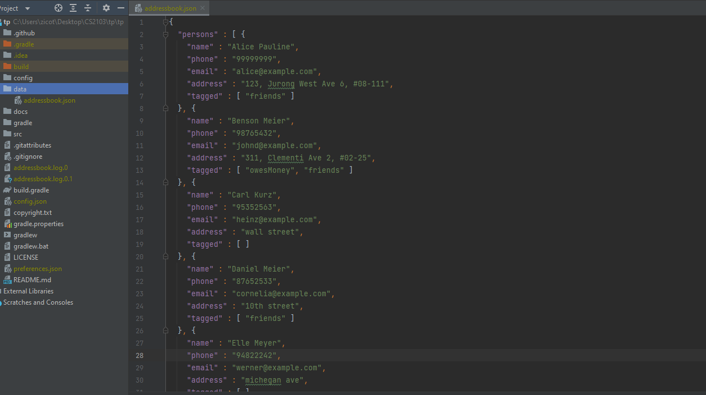

## Table of Contents

* Table of Contents
{:toc}

--------------------------------------------------------------------------------------------------------------------

## Introduction

EZLead is a **desktop app for tech leads to manage teams optimized for use via a Command Line Interface (CLI)**.
As a tech lead, you will be able to easily keep track of all the teams under you as well as each team's current and future tasks. With our app, teams management would be easier than ever.

--------------------------------------------------------------------------------------------------------------------  

Take note of the following symbols and formatting used in this document:

| Symbol               | Meaning                                               |
|----------------------|-------------------------------------------------------|
| :information_source: | Provides notes for the user                           |
| :exclamation:        | Possible errors that might come from user interaction |
| :bulb:               | Provides additional information about the feature     |

## GUI

### EZLead Main Window

### User List

--------------------------------------------------------------------------------------------------------------------

## Quick Start

1. Ensure that you have Java `11` installed in your computer.
2. Download the latest EZLead.jar from [here](https://github.com/AY2223S1-CS2103T-W09-3/tp/releases/download/v1.3.2/EzLead.jar).
3. Copy the file to the folder you want to use as the home folder for your EZLead app.
4. Double-click the file to start the app.
5. Type the command in the command box and press Enter to execute it. Some example commands you can try:
  * `userlist`: Shows the global list of all members and their details.
  * `add n/John Doe p/99853657 e/john@gmail.com a/414, North Bridge Ave 5, #09-86 t/friends t/owesMoney`: Adds a member named `John Doe` to the app.
  * `delete p/2`: Deletes the 2nd member shown in the global member list.
  * `clear`: Deletes all teams, members and tasks.
  * `exit`: Exits the app.
6. Refer to the [Features](#features) section in this user guide for more details on commands

--------------------------------------------------------------------------------------------------------------------

## Features

**:information_source: Notes about the commands:** 

* Words in `UPPER_CASE` are the parameters to be supplied by the user. 
  e.g. in `create t/TEAM-NAME`, `TEAM-NAME` is a parameter which can be used as `create t/UIDevelopers`.

* Items in square brackets are optional.
  e.g `n/NAME [t/TAG]` can be used as `n/John Doe t/friend` or as `n/John Doe`.

* Items with `…`​ after them can be used multiple times including zero times. 
  e.g. `[t/TAG]…​` can be used as ` ` (i.e. 0 times), `m/John`, `m/John m/Jane` etc.

* If a parameter is expected only once in the command but you specified it multiple times, only the last occurence of the parameter will be taken.
  e.g. if the command specifies `task/1 task/2`, only `task/2` will be taken.

* Commands are case-sensitive.
  e.g. You cannot enter HeLp instead of help

* The command keyword (e.g. `add`, `create`, `taskedit` etc.) and parameters without a prefix must be put in front (i.e. follow the format given). 
  However, parameters with a prefix can be placed in any order (i.e. for `edit`, `edit 1 n/John p/12345678` and `edit 1 p/12345678 n/John` gives the same result).

### Parameters Summary

Here is a summary of all the parameters used in EZLead commands:

| Parameter               | Refers to                                                                           | Required format                                                                                                                                                     |
|-------------------------|-------------------------------------------------------------------------------------|---------------------------------------------------------------------------------------------------------------------------------------------------------------------|
| **NAME**                | The name of the member.                                                             | It should only contain alphanumeric characters and spaces, and should not be blank.                                                                                 |
| **PHONE-NUMBER**        | The phone number of the member.                                                     | It should only contain numbers, is exactly 8 numbers long, and should not be blank.                                                                                 |
| **EMAIL**               | The email of the member.                                                            | It should follow the _local-part@domain_ format and should not be blank.                                                                                            | 
| **ADDRESS**             | The address of the member.                                                          | It can take any value, but it should not be blank.                                                                                                                  | 
| **TAG**                 | Additional information about the member.                                            | It should only contain alphanumeric characters, or it can be blank.                                                                                                 |
| **GLOBAL-PERSON-INDEX** | The index number of the member as shown in the **userlist window**.                 | It must be a **positive integer** (e.g. 1, 2, 3, ...) and cannot be more than the maximum integer value (i.e 2147483647). Otherwise it will be considered invalid.  |
| **MEMBER-INDEX**        | The index number of the member as shown in the **userlist window**                  | It must be a **positive integer** (e.g. 1, 2, 3, ...) and cannot be more than the maximum integer value (i.e 2147483647). Otherwise it will be considered invalid.  |
| **TEAM-NAME**           | The name of the team.                                                               | It should only contain alphanumeric characters, spaces, and parentheses. But it should not be blank.                                                                | 
| **TEAM-INDEX**          | The index of the team as shown in the **main window**.                              | It must be a **positive integer** (e.g. 1, 2, 3, ...) and cannot be more than the maximum integer value (i.e 2147483647). Otherwise it will be considered invalid.  |
| **TASK-NAME**           | The name of the task.                                                               | It should only contain alphanumeric characters, spaces, parentheses, and the apostrophe. But it should not be blank.                                                |
| **DEADLINE**            | The deadline of the task.                                                           | It should be a valid date in `DD-MM-YYYY` format.                                                                                                                   |
| **TASK-INDEX**          | The index of the task as shown in the task list of the team in the **main window**. | It must be a **positive integer** (e.g. 1, 2, 3, ...) and cannot be more than the maximum integer value (i.e 2147483647). Otherwise it will be considered invalid.  |

### 1. Person Features

**:information_source: Note:** 

Open the User List window before using any Person Features

#### 1.1 Viewing all members: `userlist`

Opens the User List window.

Format: `userlist`

#### 1.2 Listing all students : `list`

Shows a list of all members in the User List window.

Format: `list`

#### 1.3 Adding a member: `add`

Adds a new member to EZLead.
The new member will be shown in the User List window.

Format: `add n/NAME p/PHONE-NUMBER e/EMAIL a/ADDRESS [t/TAG]…`

Examples:
* `add n/John Doe p/99853657 e/john@gmail.com a/414, North Bridge Ave 5, #09-86 t/friends t/owesMoney` Adds a new
  member with the following details to the global member list.

#### 1.4 Editing a member's details: `edit`

Edits a member's details. Require at least one optional parameters.
The edited member's details will be reflected both in the User List window and in the _Person Card_ (Refer to the [GUI](#gui)) of the teams that the member is assigned to.

Format: `edit GLOBAL-PERSON-INDEX [n/NAME] [p/PHONE-NUMBER] [e/EMAIL] [a/ADDRESS] [t/TAG]…`

Examples:
* `edit 1 n/Johny p/91234567 e/johndoe@example.com` Edits the first member's name in the global member list to Johny,
  email to johndoe1@example.com and contact number to 91234567.

#### 1.5 Deleting a member: `delete`

Deletes a member.
The deleted member will be removed from the User List window.

Format: `delete p/GLOBAL-PERSON-INDEX`

Examples:
* `delete p/1` Deletes the first member.

#### 1.6 Locating members by name: `find`

Finds members whose names contain any of the given keywords. Results would be reflected in the user list window.

Format: `find KEYWORD [MORE_KEYWORDS]`

* The search is case-insensitive. e.g `hans` will match `Hans`
* The order of the keywords does not matter. e.g. `Hans Bo` will match `Bo Hans`
* Only the name is searched.
* Only full words will be matched e.g. `Han` will not match `Hans`
* Persons matching at least one keyword will be returned (i.e. `OR` search).
  e.g. `Hans Bo` will return `Hans Gruber`, `Bo Yang`

Examples:
* `find Pam` returns `Pamella` and `Pam Doe`
* `find alex david` returns `Alex Yeoh`, `David Li` 
  

### 2. Team Features

#### 2.1 Adding a team: `create`

Adds a team with the given name to EZLead.

Format: `create n/TEAM-NAME`

Examples:
* `create n/Team1` Adds a team with the name Team1.

**:information_source: Note:** 

Names should only contain alphanumerical characters and spaces, and it should not be blank

#### 2.2 Deleting a team: `delteam`

Deletes the given team from EZLead.

Format: `delteam TEAM-INDEX`

Examples:
* `delteam 1` Deletes the first team.

#### 2.3 Changing a team's name: `editteam`

Changes a team's name (specified by index) to the given name.

Format: `editteam t/TEAM-INDEX n/TEAM-NAME`

Examples:
* `editteam t/1 n/TEAMNEW` Changes the first team's name to 'TEAMNEW'.

#### 2.4 Assigning a member to a team: `assign`

Assigns a member to a team.

Format: `assign m/MEMBER-INDEX t/TEAM-INDEX`

**:information_source: Note:** 

MEMBER-INDEX is the index from the User List (refer to `Viewing all members` section below).

Examples:
* `assign m/1 t/1` Assigns the first member in the global member list to the first team.

#### 2.5 UnAssigning a member to a team: `unassign`

removes a member from a team.

Format: `unassign m/MEMBER-INDEX t/TEAM-INDEX`

**:information_source: Note:** 

MEMBER-INDEX is the index from the User List (refer to `Viewing all members` section below).

Examples:
* `unassign m/1 t/1` removes the first member in the global member list from the first team.

### 3. Task Features

#### 3.1 Adding a task: `taskadd`

Adds a new task to a team. Additionally, you may opt to set a deadline for the task (optional).

Format: `taskadd t/TEAM-INDEX n/TASK-NAME [d/DEADLINE]`

Examples:
* `taskadd t/1 n/Finish project d/24-12-2023` Adds a new task to team with index 1 with the description
  "Finish project". The deadline set here is 24 December 2023.

#### 3.2 Deleting a task `taskdelete`

Deletes a task in a specific team.

Format: `taskdelete t/TEAM-INDEX task/TASK-INDEX`

Examples:
* `taskdelete t/1 task/1` Deletes the first task in the first team.

#### 3.3 Marking a task as completed `taskmark`

Marks a task as completed.

Format: `taskmark t/TEAM-INDEX task/TASK-INDEX`

Examples:
* `taskmark t/1 task/1` Marks the first task in the first team as completed.

#### 3.4 UnMarking a task `taskunmark`

Marks a task as pending.

Format: `taskunmark t/TEAM-INDEX task/TASK-INDEX`

Examples:
* `taskunmark t/1 task/1` Marks the first task in the first team as pending.

#### 3.5 Updating a task description: `taskedit`

Updates a task's description. Require at least one of the optional parameters.

Format: `taskedit t/TEAM-INDEX task/TASK-INDEX [n/TASK-NAME] [d/DEADLINE]`

Examples:
* `taskedit t/1 task/1 n/Finish assignment d/12-12-2022` Updates the first task in the first team with new description
  'Finish assignment'. Adding a deadline to the task is optional.

**:information_source: TIP:** 

* To add deadline to an already existing task, use the command `taskedit t/TEAM-INDEX task/TASK-INDEX d/NEW DD-MM-YYYY`

### 4. General Features

#### 4.1 Viewing help: `help`

Shows a message explaining how to access the help page.

Format: `help`

#### 4.2 Clearing all entries : `clear`

Clears all entries from the user list, team list and task list.

Format: `clear`

### Manually editing save file

For advanced users, the data and state of EZLead is stored in `data/addressbook.json`.
You can manually modify the data directly by accessing this JSON file.

However, EZLead cannot verify validity of the data if it was manually modified. Any invalid data will cause EZLead
to load in an EMPTY state.

--------------------------------------------------------------------------------------------------------------------

## FAQ

**Q**: What should be the index of the member to be specified to assign and unassign members from a team?

**A**: You can use the index of the member provided in the user list. You can access user list by using the command `userlist`.

--------------------------------------------------------------------------------------------------------------------

## Command Summary

| Action              | Format, Examples                                                                                                                                               |
|---------------------|----------------------------------------------------------------------------------------------------------------------------------------------------------------|
| **Help**            | `help`                                                                                                                                                         |
| **Member Add**      | `add n/NAME p/PHONE e/EMAIL a/ADDRESS [t/TAG]…`   e.g. `add n/John Doe p/99853657 e/john@gmail.com a/414, North Bridge Ave 5, #09-86 t/friends t/owesMoney` |
| **Member Delete**   | `delete p/GLOBAL-PERSON-INDEX`   e.g. `delete p/1`                                                                                                          |
| **Member Edit**     | `edit GLOBAL-PERSON-INDEX [n/NAME] [p/PHONE] [e/EMAIL] [a/ADDRESS] [t/TAG]…`   e.g.`edit 1 n/Johny p/91234567 e/johndoe@example.com`                        |
| **Member List**     | `userlist`                                                                                                                                                     |
| **Team Add**        | `create n/TEAM-NAME`   e.g. `create n/TEAM1`                                                                                                                |
| **Team Delete**     | `delteam TEAM-INDEX`   e.g. `delteam 1`                                                                                                                     |
| **Team Edit**       | `editteam t/TEAM-INDEX n/TEAM-NAME`   e.g. `editteam t/1 n/TEAMNEW`                                                                                         |
| **Member assign**   | `assign m/MEMBER-INDEX t/TEAM-INDEX`   e.g.`assign m/1 t/1`                                                                                                 |
| **Member unAssign** | `unassign m/MEMBER-INDEX t/TEAM-INDEX`   e.g.`unassign m/1 t/1`                                                                                             |
| **Task Add**        | `taskadd t/TEAM-INDEX n/TASK-NAME [d/DEADLINE]`   e.g. `taskadd t/1 n/Finish project d/24-12-2023`                                                          |
| **Task Delete**     | `taskdelete t/TEAM-INDEX task/TASK-INDEX`   e.g. `taskdelete t/1 task/1`                                                                                    |
| **Task Mark**       | `taskmark t/TEAM-INDEX task/TASK-INDEX`   e.g. `taskmark t/1 task/1`                                                                                        |
| **Task unMark**     | `taskunmark t/TEAM-INDEX task/TASK-INDEX`   e.g. `taskunmark t/1 task/1`                                                                                    |
| **Task Edit**       | `taskedit t/TEAM-INDEX task/TASK-INDEX [n/TASK-NAME] [d/DEADLINE]`   e.g. `taskedit t/1 task/1 n/Finish assignment d/12-12-2022`                            |

[Back to Top ↑](#introduction)
